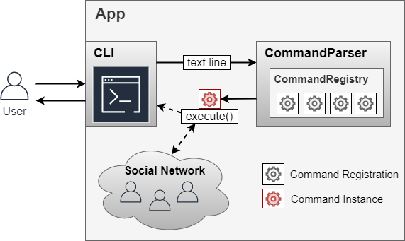
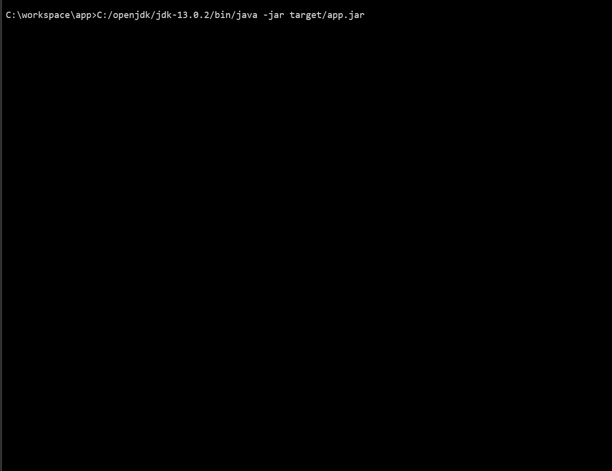

# Social Networking Kata
My solution to the [exercise](https://github.com/xpeppers/social_networking_kata) used by [XPeppers](https://www.xpeppers.com/) for their recruitment process.

----------------------

| Branch        | Build           | Coverage           |
| ------------- |:-------------:|:-------------:|
| main      	|  |  |

----------------------

### Requirements

* [Maven 3.6+](https://maven.apache.org/download.cgi)
* [Java 11](https://www.oracle.com/it/java/technologies/javase-jdk11-downloads.html)

### How to compile

In the project folder run
> mvn clean package

After packaging, you should find the `app.jar` file in the `target` folder.
Alternatively, if you don't want to compile the project you can download the [latest release](https://github.com/dsantarelli/social_networking_kata/releases).

### How to run

> java -jar target/app.jar

## Code explanation

This morning I spilled coffee on myself, therefore I choose to solve the exercise in Java.
First of all, I tried to find a simple way to specify the acceptance tests proposed by the exercise specifications.
Immediately I faced the need to simulate the system console in the test environment, so I created the [ICommandLineInterface](https://github.com/dsantarelli/social_networking_kata/tree/main/src/main/java/com/xpeppers/snk/ui) abstraction.
After writing most of the acceptance tests and making them work, I noticed that I wrote a lot of code smells, so I started a refactoring that brought me up to three macro-components:

* A user interface reading and writing text lines ([ICommandLineInterface](https://github.com/dsantarelli/social_networking_kata/tree/main/src/main/java/com/xpeppers/snk/ui)).
* A parser whose responsibility is to create an executable command given a text line ([ICommandParser](https://github.com/dsantarelli/social_networking_kata/tree/main/src/main/java/com/xpeppers/snk/command/parser)).
* A proxy towards a social network, which has its own domain ([ISocialNetwork](https://github.com/dsantarelli/social_networking_kata/tree/main/src/main/java/com/xpeppers/snk/socialnetwork)).

The application starts through the [App](https://github.com/dsantarelli/social_networking_kata/blob/main/src/main/java/com/xpeppers/snk/App.java) class.

### Improvements

* In the CommandParser, I didn't want to implement the usual factory with a lot of if/else, so I tried to introduce a [ICommandRegistry](https://github.com/dsantarelli/social_networking_kata/blob/main/src/main/java/com/xpeppers/snk/command/parser/ICommandRegistry.java) interface. The aim was to find a more flexible solution so that the command configurations could be injected into the parser from an external source. The overall architecture could be summarized through the following image:

* I added the [Help](https://github.com/dsantarelli/social_networking_kata/blob/main/src/main/java/com/xpeppers/snk/command/HelpCommand.java) and [Exit](https://github.com/dsantarelli/social_networking_kata/blob/main/src/main/java/com/xpeppers/snk/command/ExitCommand.java) commands. They came for free. In particular, I suddenly realized that the Help command could print the list of available commands coming from the ICommandRegistry. Cool!

* In order to print the `n <chrono unit> ago`, I wanted to use [PrettyTime](https://www.ocpsoft.org/prettytime/), but in the end I fell back on a [simple homemade solution](https://github.com/dsantarelli/social_networking_kata/blob/main/src/main/java/com/xpeppers/snk/text/PrettyTimeFormatter.java). 

### Demo

